# appthere-color v0.1.0 — Implementation Walkthrough

## Summary

Implemented the complete `appthere-color` crate from scratch — a document-aware color management library for Rust using `moxcms` as the pure-Rust ICC backend. All modules are implemented, tested, and documented.

## Architecture

```mermaid
graph TD
    A[lib.rs] --> B[error.rs]
    A --> C[rendering_intent.rs]
    A --> D[color_space.rs]
    A --> E[color_value.rs]
    A --> F[color_value_ext.rs]
    A --> G[profile.rs]
    A --> H[transform.rs]
    A --> I[proofing.rs]
    A --> J[proofing_builder.rs]
    A --> K[policy.rs]
    
    G -->|wraps| L[moxcms::ColorProfile]
    H -->|uses| L
    I -->|chains 2 transforms| L
    
    style A fill:#2d5a27
    style G fill:#4a2d5a
    style H fill:#4a2d5a
    style I fill:#4a2d5a
```

## Files Created

| File | Lines | Purpose |
|------|-------|---------|
| [Cargo.toml](file:///d:/project/appthere-color/Cargo.toml) | 18 | Crate metadata, deps (`moxcms`, `thiserror`), `std`/`serde` features |
| [lib.rs](file:///d:/project/appthere-color/src/lib.rs) | 79 | `#![forbid(unsafe_code)]`, `no_std`, module declarations, re-exports |
| [error.rs](file:///d:/project/appthere-color/src/error.rs) | 95 | `ColorError` (8 variants), `ColorResult<T>` |
| [rendering_intent.rs](file:///d:/project/appthere-color/src/rendering_intent.rs) | 121 | 4 ICC rendering intents with `moxcms` interop |
| [color_space.rs](file:///d:/project/appthere-color/src/color_space.rs) | 151 | `ColorSpace` enum with channel counts and layout mapping |
| [color_value.rs](file:///d:/project/appthere-color/src/color_value.rs) | 251 | `RgbColor`, `CmykColor`, `LabColor` with clamping |
| [color_value_ext.rs](file:///d:/project/appthere-color/src/color_value_ext.rs) | 209 | `XyzColor`, `GrayColor`, `ColorValue` enum |
| [profile.rs](file:///d:/project/appthere-color/src/profile.rs) | 216 | `IccProfile` wrapping `moxcms::ColorProfile` |
| [transform.rs](file:///d:/project/appthere-color/src/transform.rs) | 261 | `ColorTransform` builder + f32 transform execution |
| [proofing.rs](file:///d:/project/appthere-color/src/proofing.rs) | 193 | `ProofingConfig`, `GamutWarning`, two-stage proof |
| [proofing_builder.rs](file:///d:/project/appthere-color/src/proofing_builder.rs) | 181 | `ProofingConfigBuilder` (split for 300-line limit) |
| [policy.rs](file:///d:/project/appthere-color/src/policy.rs) | 290 | `ColorPolicy`, `OutputIntent`, embedded profile registry |
| [CHANGELOG.md](file:///d:/project/appthere-color/CHANGELOG.md) | 39 | v0.1.0 release notes |

## Key Design Decisions

1. **File splitting**: `color_value` and `proofing` each split into two files to stay under the 300-line hard ceiling
2. **CMYK layout**: Uses `moxcms::Layout::Rgba` for CMYK since `moxcms` treats 4-channel data with RGBA memory layout
3. **Lab/XYZ layout**: Uses `moxcms::Layout::Rgb` (3-channel) — `moxcms` handles the Lab/XYZ encoding internally via profile color space metadata
4. **`BTreeMap` for policy**: Uses `BTreeMap` instead of `HashMap` for `no_std` compatibility in the embedded profile registry
5. **Proofing as chained transforms**: Two separate `moxcms` transform executors chained through a `Vec<f32>` intermediate buffer

## Verification Results

| Check | Result |
|-------|--------|
| `cargo build` | ✅ Zero warnings |
| `cargo test` | ✅ 127 tests pass (17 unit + 19 integration + 91 doc-tests) |
| `cargo clippy --all-targets -- -D warnings` | ✅ Zero warnings |
| `RUSTDOCFLAGS="-D warnings" cargo doc --no-deps` | ✅ Zero warnings |
| No `.unwrap()`/`.expect()` in `src/` | ✅ Verified |
| No `unsafe` in crate | ✅ `#![forbid(unsafe_code)]` enforced |
| All files ≤ 300 lines | ✅ Max: 290 (policy.rs) |
